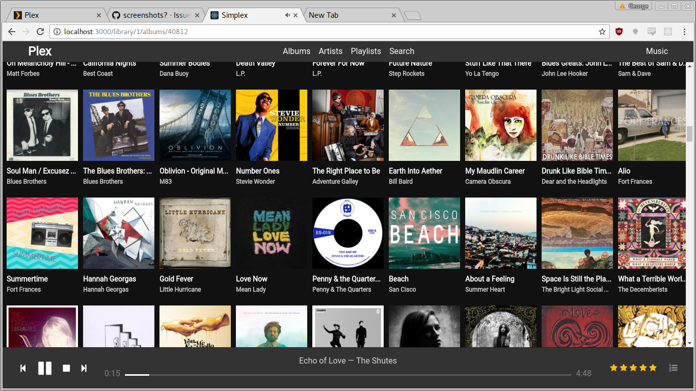
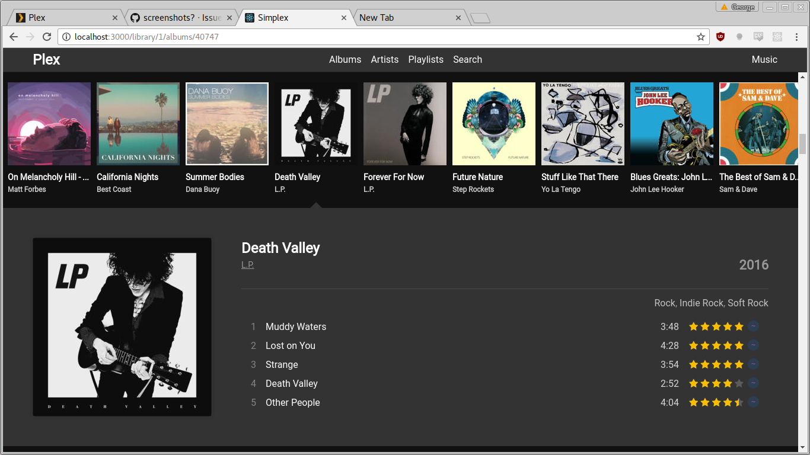
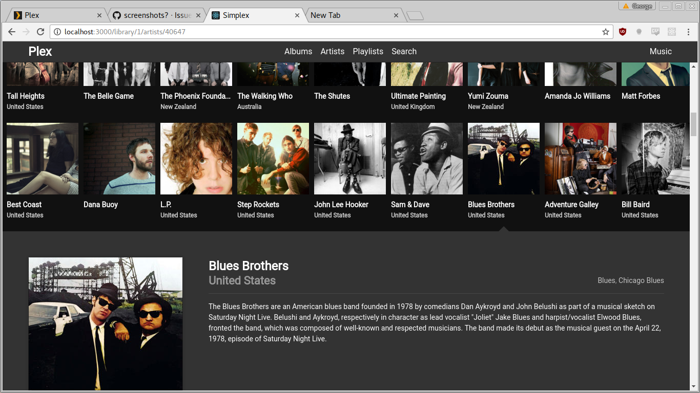
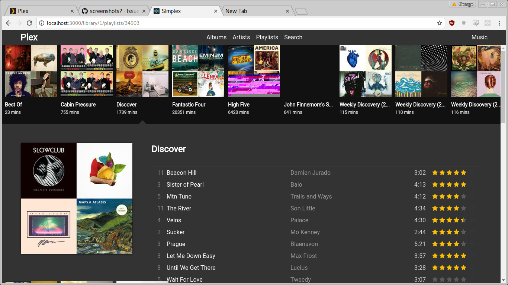
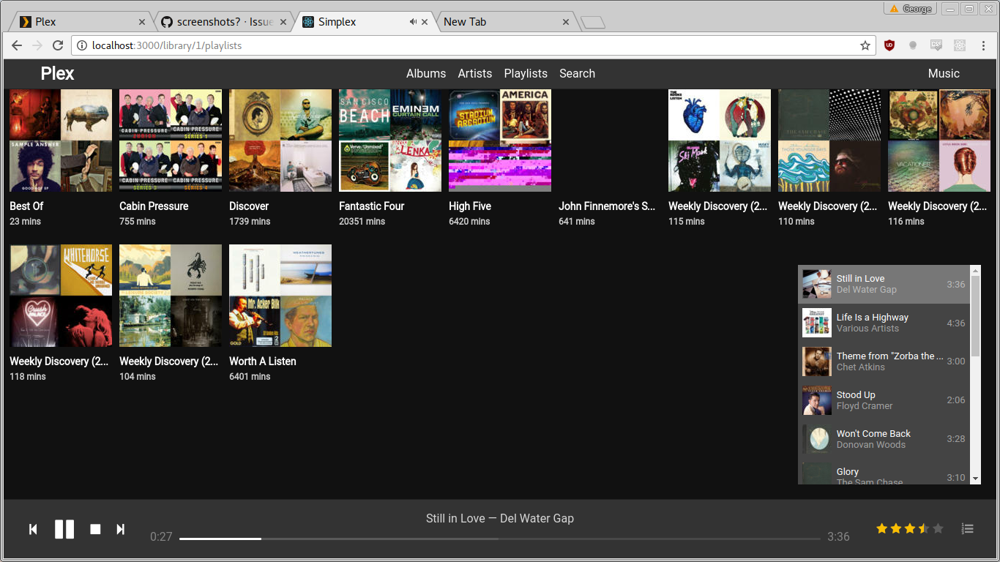

# Simplex

> A custom Plex web client that is built for music.

**Note: this project is still in early development.**

## Installation

```
git clone https://github.com/stayradiated/simplex
cd simplex

cp config.default.json config.json
vim config.json

yarn
yarn start
```

Then open http://localhost:3000/library in your browser. Select a music library from the top right, and then select 'albums' in the top center.

## Screenshots

**Note: My main focus at the moment is on getting the underlying API working,
so the current UI is just meant to be a prototype**.

**Album list (with player)**



**Selected album with track list**



**Selected artist with summary**



**Selected playlist with tracklist**



**Play Queue**


