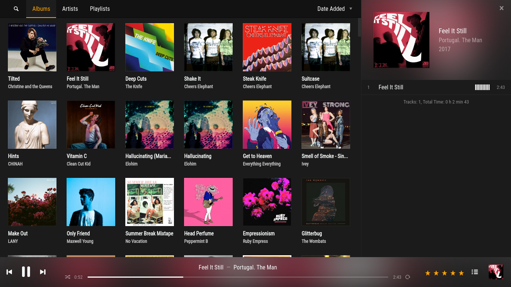
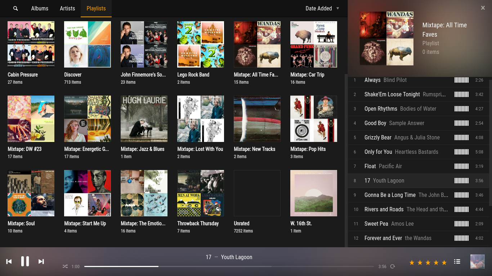

# hifi.kitchen

> A custom Plex web client that is built for music.

**Note: this project is still in early development.**

## Installation

```
git clone https://github.com/stayradiated/hifi.kitchen
cd hifi.kitchen
yarn       # or npm install
yarn start # or npm start
```

Then open http://localhost:3000/library in your browser. Select a music library
from the top right, and then select 'albums' in the top center.

## Screenshots




